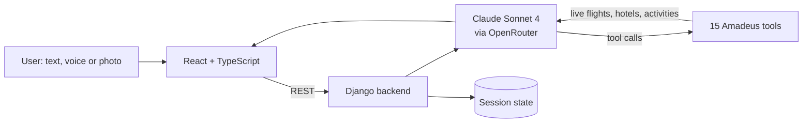

# SkyPath — tool-calling travel agent on live Amadeus data

A conversational trip planner. An LLM agent calls **15 Amadeus API tools** to search real flights, hotels and activities, then assembles a trip plan the user can refine step by step. 🏆 **4th place at the UiPath Future Forward Hackathon 2025** **[TODO: out of how many teams?]**

**[TODO: add a screenshot or GIF — e.g. ``]**

## Problem

Travel aggregators return long, noisy lists of options. A general-purpose chatbot, on the other hand, invents prices and schedules. SkyPath keeps the conversational interface but **grounds every flight, hotel and price in live Amadeus data**.

## How it works

- **Tool-calling loop.** The backend is Django REST and runs **Claude Sonnet 4 (via OpenRouter)**. Each user message can trigger up to 10 rounds of tool calls before the agent answers.
- **15 Amadeus tools:**
  - flights: offer search and pricing, cheapest-date search, flight inspiration;
  - hotels: hotel list, search, offers and ratings;
  - tours & activities;
  - airport/city search, direct destinations, airline destinations;
  - trip-purpose prediction.
- **Stateful sessions.** Conversation history and workflow state (selected flight, hotel, dates) are persisted per session, so the plan can be refined over several turns. Endpoints: `/chat`, `/update_state`, `/summary`, `/reset`.
- **Photo → destination.** `/locate_city` uses a vision model to identify the city in a user's photo and start planning a trip there.
- **Voice.** The frontend supports speech input and spoken replies (OpenAI speech-to-text and text-to-speech).

**[TODO: if the hackathon version also included agents built in UiPath (e.g. separate flight / hotel / itinerary agents), describe that part here — this repository contains the single tool-calling agent described above.]**



## Tech stack

**Backend:** Python, Django 5, Django REST Framework, Amadeus Self-Service API, OpenRouter
**Frontend:** React, TypeScript, Vite, Tailwind CSS

## How to run

Create `backend/.env` (see `backend/.env.example`), then:

```bash
pip install -r requirements.txt
cd backend
python manage.py migrate
python manage.py runserver        # http://localhost:8000
```

```bash
cd frontend
cp .env.example .env              # set VITE_API_URL
npm install
npm run dev
```

The Amadeus **test** environment is free: create an app at developers.amadeus.com to get a client ID and secret.

## What I'd improve

- **Evaluation.** Build a set of travel requests with the expected tool calls. Measure tool-selection accuracy, and check that no price or schedule appears in a reply unless it came from a tool result.
- **Tests.** Add unit tests for the tool layer with mocked Amadeus responses.
- **API key safety.** Move the speech-to-text and text-to-speech calls behind the backend. Right now the OpenAI key is read by the frontend and ends up in the browser bundle.
- **Streaming.** The frontend has a WebSocket client, but the backend only serves REST. Stream partial answers with Django Channels or SSE.
- **Repo hygiene.** Remove the committed `frontend/node_modules`.

## My contribution

Team project. I worked on the LLM layer of the backend:

- **Tool calling**, together with Rareș Roșcan: defined the 15 Amadeus tools as JSON schemas for the model and built the tool-calling loop. The agent can chain up to 10 rounds of tool calls per message, with each tool result fed back into the conversation before the final answer.
- **LLM integration in the backend:** connected Claude Sonnet 4 (via OpenRouter) to the Django API, through the chat service that sends the conversation history to the model, runs the tools it requests and returns the final answer to the frontend.
